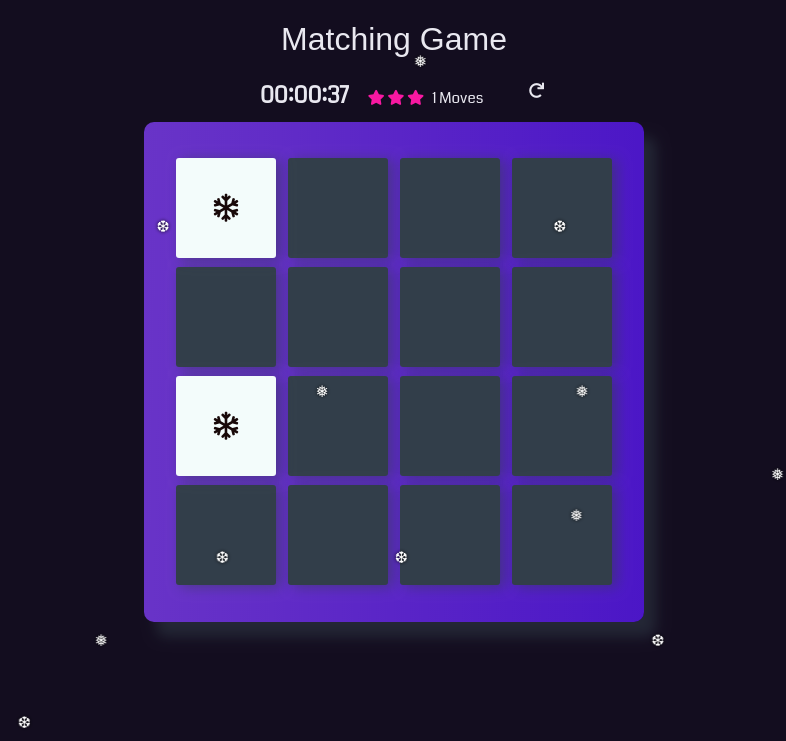

# Memory Game Project

## Table of Contents

* [Instructions](#instructions)
* [Contributing](#contributing)
* How to play
* Dependencies

.

## Contributing

This repository is the starter code for _all_ Udacity students. Therefore, we most likely will not accept pull requests.

For details, check out [CONTRIBUTING.md](CONTRIBUTING.md).

## How to play
- A user must select 2 cards a time.
- Mismatched card will be turned over, and the user must select a new pair of cards.
- Once all 8 pairs are matched, the user is prompted to play again.
- The player is given a score of 1 star to 3 stars depending on how many moves are made.
- Time is kept from when the user makes his/her first selection

## Dependencies
- Font Awesome
- jQuery 

